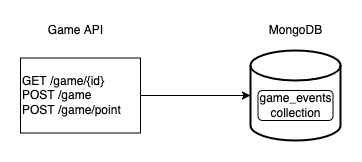

# DCSL GS backend Code Challenge - Tennis game 🎾

## 💭 Context

You are part of a team working on a project for a client who is developing a `tennis game`.

The app already has the following features:

1. Basic business logic (more info [here](#business-logic-implementation)).
2. Unit tests with [jest](https://jestjs.io/) of the implemented functionalities.
3. e2e tests with [jest](https://jestjs.io/) and [supertest](https://www.npmjs.com/package/supertest) of the implemented functionalities.

## ℹ️ Useful information

### Essential commands

- To install the dependencies:

   ```
   npm i
   ```

- To run the app:

   ```
   npm start
   ```

- To execute all the tests:

   ```
   npm test
   ```

- To execute the unitary tests:

   ```
   npm run test:unit
   ```

- To execute the e2e tests:

   ```
   npm run test:e2e
   ```

### Team Agreements
 
- Communication between the team is fundamental. If anyone is blocked or has any doubts, it is best to ask the rest of your teammates.
- Commits must follow the [Conventional Commits specification](https://www.conventionalcommits.org/en/v1.0.0/).
- To consider the task done:
   - The task specified must be implemented
   - Existing tests must pass
   - In case of adding new functionalities, new tests must be added
- Once the task is completed, a Pull Request from the branch must be created so that it’s reviewed by the rest of the team before merging to the `main` branch.

## 🔜 Previous steps to the live coding

1. Clone the repository in your local environment.
2. Use the editor of your choice to visualise and edit the code.

## 💻 Live coding tasks
 
With your teammates’ help, you must complete the tasks given to the highest possible quality, always following the Team Agreements.

1. Try to execute the code locally and verify that it runs correctly. If not, try to solve any bugs you find until the app works as expected.
2. Run the unit tests and verify that they run correctly. Otherwise, try to fix the bugs you find until the tests pass.
3. Run the integration tests and verify that they run correctly. Otherwise, try to fix the bugs you find until the tests pass.
4. Through __TDD__ add into the file `storage.js` the necessary logic to store the scoreboard.
5. Through __TDD__ add into the file `routes.js` an endpoint to obtain the scoreboard.

##  📚TL:DR;

### Business Logic implementation

The business logic is divided into 2 services:  `gameService` y `scoreService`. The logic of both is explained below.

#### scoreService

This service manages the logic for managing changes in the state of the players' score. To do so, it implements the `State design pattern` following a functional style.

Basically, we have one function for each type of state that score can take (Love, Thirteen, etc). All these functions return an object with the same interface, but different behaviour ([here](#score) to see the common interface):

- `name`: identifying name of the score (Love, Thirteen, etc)
- `winBall`: function that returns the score resulting from scoring a point. As input, it expects to receive the opponent's score.
- `loseBall`: function that returns the score resulting from the opponent scoring a point. As input, it expects to receive the opponent's score.

#### gameService

This service is in charge of managing the status of a game every time a point is marked.

It receives as input the current game state, and the id of the player who has scored a point. It then updates the winning player's score and the losing player's score, using the common score interface.

### Architecture

The app is a Rest API created with the [express framework](https://expressjs.com/), which is connected to a [MongoDB database](https://www.mongodb.com/) to persist the application data.



#### Routes

- **`GET /game`**: returns the current state of a game.
- **`POST /game`: saves a new event of type `new_game` in the database.
- **`POST /game`**: saves a new event of type `game_point` in the database.

More information in the app Swagger docs (http://localhost:400/api-docs) and [Postman collection](./docs/postman/back-live-coding-challenge.postman_collection.json)

#### MongoDB

The database has only one collection `game_events` where the game events are stored. More information about game event entities [here](#game-events).

### Project Structure

All business logic is located in the `src` folder, divided into components. The main components are:

- `App`: Express configuration.
- `Constants`: app constants.
- `Errors`: app custom errors.
- `Factories`: factory functions to create the app entities.
- `MongoDB`: MongoDB configuration.
- `Routes`: API routes.
- `Services`: services containing the app business logic.
- `Storage`: functions to storage app data.

### Entities

#### Game Events

- New Game Event

  ```json
  {
    "type": "new_game",
    "id": 1,
    "player1Id": 1,
    "player2Id": 2,
    "timestamp": "1970-01-01T00:00:00Z"
  }
  ```

- Game Point Event

  ```json
  {
    "type": "game-point",
    "id": 1,
    "playerId": 1,
    "timestamp": "1970-01-01T00:00:00Z"
  }
  ```

#### Score

  ```json
  {
    "name": "Love",
    "winBall": (opponentPlayerScore) => {},
    "loseBall": (opponentPlayerScore) => {}
  }
  ```

#### Player

  ```json
  {
    "id": 1,
    "score": {}
  }
  ```

#### Game

  ```json
  {
    "id": 1,
    "player1": {},
    "player2": {}
  }
  ```
